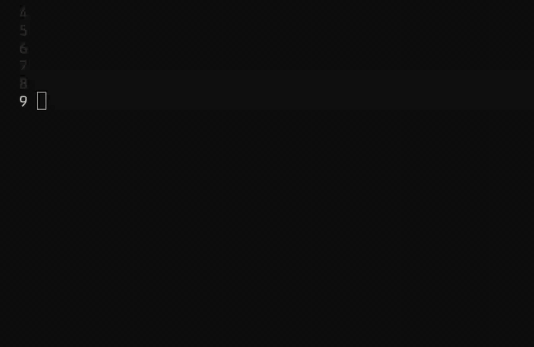

<picture>
  <source srcset="./assets/logo-dark.svg" media="(prefers-color-scheme: dark)"/>
  <source srcset="./assets/logo-light.svg" media="(prefers-color-scheme: light)"/>
  
</picture>
<br/>
<br/>
<b>filemention.nvim</b>
<br/>
<br/>
type <code>@</code> in insert mode.
<br/>
fuzzy-pick a file.
<br/>
<br/>
get a <code>@path/to/file</code> mention — native to nvim.

<br/>
<br/>



<br/>
<br/>
<br/>

### install

with [lazy.nvim](https://github.com/folke/lazy.nvim) (the `event` is optional - just lazy-loads on first insert):

```lua
{ "not-manu/filemention.nvim", event = "InsertEnter", opts = {} }
```

then wire it into your completion engine:

<details open>
<summary><b>nvim-cmp</b></summary>

```lua
sources = cmp.config.sources({
  { name = "filemention" },
  -- ...your other sources
})
```
</details>

<details>
<summary><b>blink.cmp</b></summary>

```lua
sources = {
  default = { "filemention", "lsp", "path", "snippets", "buffer" },
  providers = {
    filemention = {
      name = "filemention",
      module = "filemention.sources.blink",
    },
  },
}
```
</details>

> heads up: by default filemention only activates in `markdown`, `text`, and `gitcommit` files. trying it in a `.lua` buffer and seeing nothing? set `filetypes = "*"` (see config below).

### config

defaults are sensible. but if you must:

```lua
require("filemention").setup({
  trigger = "@",                  -- the magic key
  root = "git",                   -- "git" | "cwd" | function() return path end
  respect_gitignore = true,       -- don't surface your node_modules sins
  include_hidden = false,
  format = "bare",                -- "bare" | "markdown" | function(path, name)
  filetypes = { "markdown", "text", "gitcommit" },  -- or "*" if you live dangerously
  max_items = 500,
  finder = "auto",                -- "auto" | "fd" | "rg" | "vim" | "fff"
})
```

### the `[@` trick

type `[@` instead of `@` and you get a real markdown link:

```
[@README.md](README.md)
```

handy when you're writing actual prose and the bare `@path` looks ugly.

### optional: fff.nvim

if you already use [fff.nvim](https://github.com/dmtrKovalenko/fff.nvim), set `finder = "fff"` to get frecency-ranked, typo-resistant completion using fff's in-process rust index. recently-accessed files float to the top, and typos in the query still match.

```lua
require("filemention").setup({ finder = "fff" })
```

filemention does **not** install or configure fff. it just uses fff's index if you have it set up. if fff isn't installed (or hasn't been initialized yet), filemention silently falls back to `fd` → `rg` → `vim`.

### under the hood

- file discovery via `fd` → `rg` → pure-lua `vim.fs.dir` (whichever it finds first)
- git root by default, falls back to cwd
- only activates in text-ish filetypes so it doesn't pop up while you're writing real code
- no dependencies beyond your completion engine

<br/>
<br/>
<br/>

<div align="right">
<i>...yet another one of manu's creations</i> &nbsp;&bull;&nbsp; <a href="./LICENSE">MIT</a>
</div>
